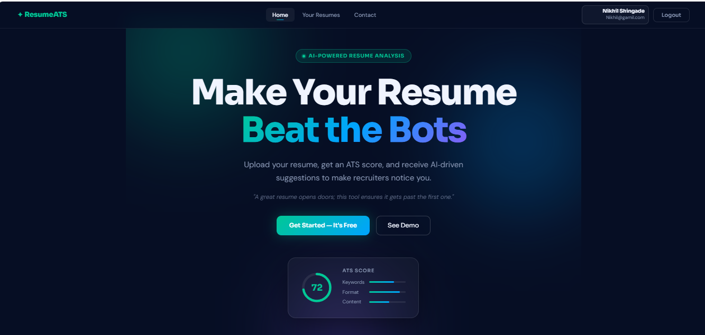
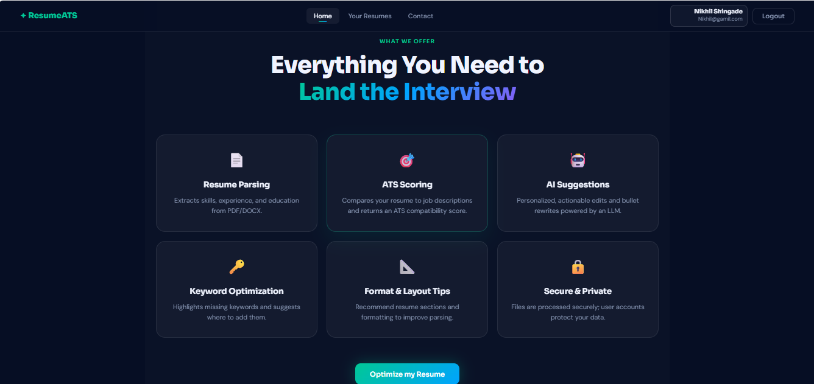
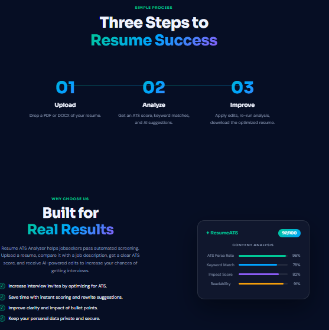

# 🚀 ATS Resume Analyzer

## AI-Powered Resume Screening & Optimization Platform

An intelligent full-stack web application that evaluates how well a resume matches a job description using ATS (Applicant Tracking System) logic and AI-driven recommendations.

Designed to simulate real-world hiring filters, this tool helps job seekers optimize resumes, improve keyword matching, and increase interview chances.

### 🌟 Key Features
#### 🏠 Home Page


#### ⚙️ Features Section


#### 🔄 Process Flow


#### ✨ User Authentication

Secure registration & login (JWT-based authentication)
Protected routes for authorized access

### 📄 Resume Processing

Upload PDF resumes
Automatic text extraction

### 📊 ATS Compatibility Score

Compares resume with job description
Keyword-based scoring system
Real-time analysis feedback

### 🤖 AI-Powered Insights (Google Gemini API)

Missing skills detection
Resume bullet point improvements
Interview preparation tips
Actionable content suggestions

### 💾 Persistent Storage

Lightweight and efficient SQLite database
Stores user and resume data locally
🛠️ Tech Stack
🔹 Frontend
React.js
React Router
Vite
🔹 Backend
Node.js
Express.js
🔹 Database
SQLite (sqlite3)
🔹 AI Integration
Google Gemini API
🔹 Other Tools
Multer (File Upload Handling)
JWT (Authentication)

### 📁 Project Structure

```bash
ATS-Resume_Analyzer/
│
├── backend/
│   └── backend/
│       ├── controllers/
│       ├── routes/
│       ├── models/
│       ├── utils/
│       ├── db/
│       ├── .env
│       ├── package.json
│       └── server.js
│
└── frontend/
    ├── src/
    ├── package.json
    └── vite.config.js
### ⚙️ Prerequisites
Node.js (v18+)
npm (v9+)
Internet connection (for Gemini API)
🔐 Environment Setup (Backend)

Create a .env file inside:

backend/backend/.env

Add the following:

PORT=5000
SQLITE_PATH=./data/resume-analyzer.sqlite
JWT_SECRET=your_jwt_secret_here
GEMINI_API_KEY=your_gemini_api_key_here

### ⚠️ Important Notes

Never commit .env file to GitHub
Keep your API keys secure
▶️ Run Locally
1️⃣ Start Backend
cd backend/backend
npm install
npm start

### Backend runs at:
👉 http://localhost:5000

2️⃣ Start Frontend
cd frontend
npm install
npm run dev

Frontend runs at:
👉 http://localhost:5173

### 💡 How It Works
Register/Login into the system
Upload your resume (PDF format)
Paste a job description (minimum 20 words)
Click Analyze
Get:
ATS Score 📊
Missing Keywords ❌
AI Suggestions 🤖
Resume Improvements ✍️
🔗 API Endpoints

Base URL: http://localhost:5000

Method	Endpoint	Description
POST	/auth/register	Register new user
POST	/auth/login	Login & get JWT
GET	/auth/me	Get current user
POST	/resume/upload	Upload resume
POST	/resume/analyze	Analyze resume
⚠️ Troubleshooting

❌ Server not running

Ensure backend is running on port 5000

❌ Login issues

Check credentials or register again

❌ Short job description

Provide at least 20 words

❌ Gemini API errors

Verify API key is valid

❌ Port already in use

Change PORT in .env
🚀 Future Enhancements
🔐 Password hashing using bcryptjs
🔄 Refresh tokens & session management
📈 Advanced analytics dashboard
📂 Resume history & downloadable reports
🐳 Docker deployment support
☁️ Cloud deployment (AWS / Render / Vercel)
📌 Use Cases
Students preparing for placements
Job seekers optimizing resumes
Career coaches & mentors
HR tech experimentation
📜 License

This project is intended for educational and portfolio use.
You can add an MIT License if publishing publicly.

### 👨‍💻 Author

Nikhil Shingade
Passionate about AI, Data Science & Full-Stack Development

### ⭐ Support

If you found this project useful:

👉 Star this repository
👉 Share on LinkedIn
👉 Contribute to improve it

💡 “Your resume is your first impression — make it intelligent.”
